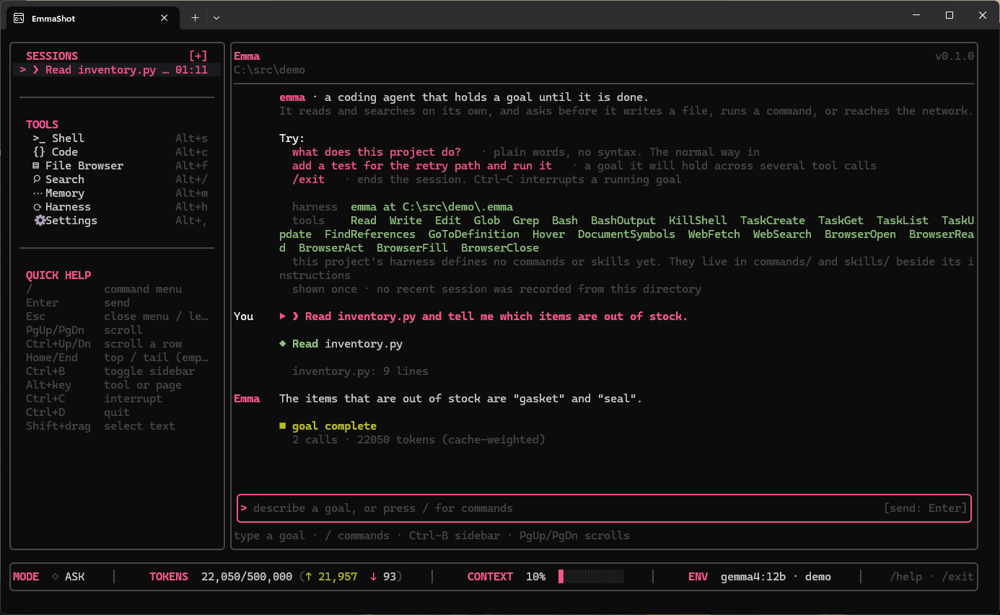

# Emma

A coding agent you run from a terminal. You type `emma`, it reads its
configuration from the directory you are standing in, and it works on your goal
until the goal is met or it runs out of the budget you gave it.



```
$ emma
> port the auth middleware to the new session API and make the tests pass
```

## What it is

**A loop.** Send the conversation to a model, run whatever tools it asks for,
append what happened, send it again. Stop when the goal is met, when the budget
is spent, or when a rule says stop.

**A harness with no prompt compiled into it.** Emma finds a configuration
directory by walking up from your working directory, the way git finds `.git`,
and loads a persona, its skills, its commands and its hooks from files you
wrote. Swapping the directory swaps the agent.

**A goal, held.** Emma is told what "done" looks like and keeps going — a tool
failed, so try another way; the tests are still red, so read the failure and fix
it — until done is true or it runs out of room.

**Any model that can call tools.** Anthropic over the API, or Ollama on your own
machine.

### What it is not

- Not a service. No web UI, no HTTP server, no accounts, no login.
- Not multi-user. One person, one terminal.
- Not a retrieval engine. No corpus, no index, no chunking. If Emma needs to
  know what a file says, it reads the file.

## Install

Emma is Rust, and there are no published binaries yet — you build it.

```
$ git clone https://github.com/01000001-01001110/emma-harness.git
$ cd emma
$ cargo install --path crates/emma
```

That puts `emma` in `~/.cargo/bin`. Linux, macOS and Windows all work; the test
suite runs on Windows and macOS.

## Set up a model

Emma needs a provider before it can do anything. Pick one.

### Ollama, on your own machine — free, private, no key

Install [Ollama](https://ollama.com), pull a model that can call tools, and
point Emma at it.

```
$ ollama pull llama3.1:8b
$ emma set-provider ollama --model llama3.1:8b
```

There is no key to paste and Emma will not ask for one. Nothing leaves your
machine.

**Pick a model that supports tool calling.** Emma's whole loop is tool calls, so
a model that ignores the tool schema looks like a broken harness rather than a
poor fit. `llama3.1`, `qwen3` and `gemma4` work. Size matters more here than it
does for chat: an 8B model will read a file and answer a question about it, and
will struggle with a multi-step refactor.

Emma talks to `http://127.0.0.1:11434` unless `OLLAMA_HOST` says otherwise. If
that variable points anywhere but this machine, Emma names the destination
before the first call — a stale value in a shell profile would otherwise ship
your whole conversation, instructions and file contents included, to a box you
had forgotten about.

### Anthropic — a key, and a bill

```
$ emma set-provider anthropic
anthropic API key (not echoed):
```

The key is stored in `~/.emma/credentials.json`, and `ANTHROPIC_API_KEY` in the
environment outranks it. Choose a model with `emma set-model claude-sonnet-5`,
or for one run with `--model`.

### Checking what is in force

```
$ emma config check
```

It loads everything, prints what the model will actually be told, and calls no
model. Run it first whenever Emma does something you did not expect.

## First run

```
$ cd your-project
$ emma init                      # writes a minimal .emma/ here
$ emma goal "explain what src/parser.rs does"
```

`emma init` is unnecessary if the project already has a `.claude/` directory —
Emma reads Claude Code's configuration as it stands. When both exist, `.emma/`
wins outright and nothing is merged.

Run `emma` with no arguments for an interactive session. A goal runs to
completion, then the prompt returns, and the next thing you type continues the
same conversation: a follow-up question does not re-read the file the first
answer came from. Type `/` for the command list, `Ctrl-C` to stop a goal in
flight, `/exit` to leave.

## What it does without asking

Emma writes files and runs commands, so this is the part worth reading.

Read, Glob and Grep run silently. **Write, Edit and Bash ask**, and the prompt
shows what will actually happen — the command, the diff, or the path and size.
Reaching a new host asks once for that host. Answering `a` allows that one tool
for the rest of the process and no longer: no permission outlives the run, and
none can be set from a configuration file.

`-p` is the non-interactive mode. There is nobody to ask, so anything needing
approval is denied and the model is told why.

`--dangerously-skip-permissions` turns the gate off. It announces itself on
every run and cannot be set from configuration.

**The gate is a consent interface, not a sandbox.** It shows you what a tool
declared it would do, and asks. It does not confine the tool, and `Bash` can do
anything the shell can do. Treat approving a command exactly as you would treat
running it yourself.

## Configuration

```
.emma/
  config.json              which persona is default, what hooks exist
  personas/
    _shared/rules.md       rules every persona obeys
    <name>/rules.md        this persona's rules
    <name>/soul.md         this persona's voice
  skills/<name>/SKILL.md   a capability, described in markdown
  commands/<name>.md       expanded when you type /<name>
  hooks/<script>           run before or after a tool call
  tasks/tasks.md           the agent's task list, in a file you can edit
```

Tools available to the model: `Read`, `Write`, `Edit`, `Glob`, `Grep`, `Bash`,
`BashOutput`, `KillShell`, four task-list tools, four language-server tools
(`FindReferences`, `GoToDefinition`, `Hover`, `DocumentSymbols`), `WebFetch`,
`WebSearch`, and five browser tools that drive a real Chrome.

`WebSearch` needs a Brave Search key, in `~/.emma/credentials.json` or
`BRAVE_SEARCH_API_KEY`. Without one Emma says that tool is unavailable and
carries on.

## Budgets

Every goal runs under limits, and Emma stops rather than overrunning them.

| Flag               | Default | What it bounds                                    |
| ------------------ | ------- | ------------------------------------------------- |
| `--max-iterations` | 60      | model calls per goal                              |
| `--max-tokens`     | 500000  | billable tokens per goal                          |
| `--timeout`        | 1800    | seconds of wall clock per goal                    |
| `--max-kicks`      | 3       | times the loop may say "not done, continue"       |
| `--max-context`    | 120000  | request size before the conversation is compacted |

## What it cannot do yet

Stated plainly, because the alternative is you finding out.

- **Done is the model's own claim.** Emma stops when the model says the goal is
  met. The honest guarantee is that the loop will not stop _before_ that, not
  that the work is correct. Checking a goal against the project's own tests is
  designed and not built.
- **Resume brings back the conversation, not the work.** `--resume` restores the
  transcript and the budget already spent. It re-runs nothing.
- **Nothing lists what you could resume.** There is no `emma sessions`.
- **Two providers.** Anthropic and Ollama. Anything speaking the OpenAI API,
  OpenRouter included, is not wired up.

## Documentation

**Open [`docs/index.html`](docs/index.html) in a browser.** No server, no build
step. It covers the loop, sessions, providers, tools, consent, delegation, the
terminal and configuration.

Every non-obvious claim on those pages cites the file it came from and carries
one of three marks: `certified` for something observed against the real API,
terminal or file on disk; `tested` for something a test covers; `unverified` for
something believed but unchecked, and then what would settle it.

## Bugs, questions and changes

**File an issue:** <https://github.com/01000001-01001110/emma-harness/issues>

A useful report here says which binary you ran (`emma --version`, plus the
commit if you built it yourself), your OS and terminal, your provider and model,
and the output of `emma config check` from the directory where it went wrong.
Terminal problems depend on every one of those — a cell buffer is not a console,
and this project has shipped a fully-tested display defect twice.

If Emma wrote or ran something you did not expect, `emma config check` and the
session transcript — its path is printed when Emma exits — are the two things
that usually explain it.

Pull requests are welcome. Two house rules that will come up in review: a
comment carries the argument for a decision rather than restating the code, and
a behaviour whose test cannot fail is not covered, so show that the test goes
red when the guarantee is removed.

## Licence

Apache-2.0 — see [`LICENSE`](LICENSE). You may use, modify and distribute Emma,
commercially included, and need nobody's permission to do so.

What the licence does not settle is what _this repository_ ships, which is
governance and deliberately separate: see [`GOVERNANCE.md`](GOVERNANCE.md). The
short version is that the final say on what lands here belongs to the
maintainer, and that forking is a legitimate answer if a decision here is wrong
for you.
